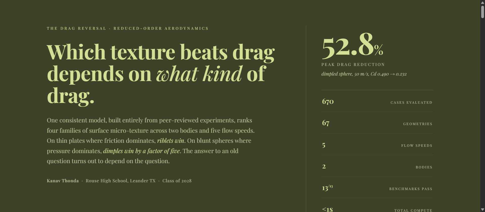
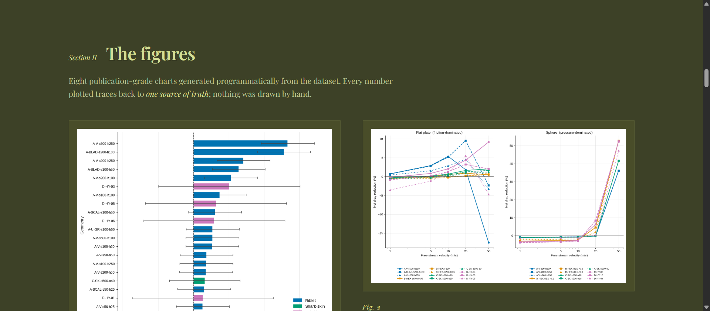
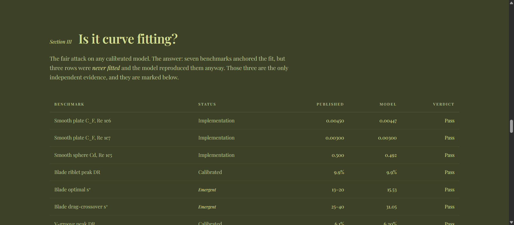
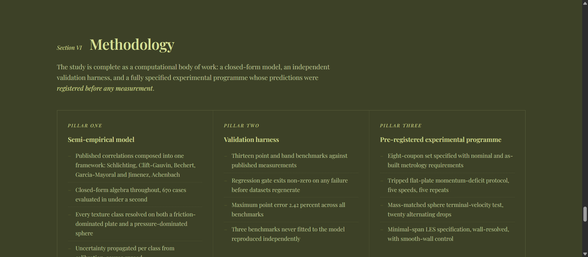

# The Drag Reversal

**Which surface texture beats drag depends on what kind of drag dominates.**
A systematic, 670-case comparison of surface micro-textures under one
consistent physical framework, with propagated uncertainty on every number.

**Live overview:** https://drag-reversal.vercel.app

## Screenshots

| Hero | Findings |
|---|---|
|  |  |

| Validation | Methodology |
|---|---|
|  |  |

## The study

Prior work overwhelmingly examines one texture class on one body at one
Reynolds number. This study composes published, peer-reviewed drag
correlations into a single reduced-order framework and compares four texture
families (riblets, dimples, shark denticles, riblet-dimple hybrids) across
two bodies and five speeds:

| Quantity | Value |
|---|---|
| Cases evaluated | 670 (67 geometries x 5 speeds x 2 bodies) |
| Test bodies | 100 mm flat plate (friction-dominated), 42.7 mm sphere (pressure-dominated) |
| Speeds | 1, 5, 10, 20, 50 m/s |
| Validation benchmarks | 13/13 passing, maximum point error 2.42% |
| Independent (emergent) confirmations | 3 of 13 benchmarks |
| Total compute | Under one second (closed-form algebra) |

## Headline findings

1. **The winning texture reverses with the drag mechanism.** Riblets win on
   the plate (+9.506% +/- 1.5 pp, blade riblets at 20 m/s); dimples win on the
   sphere (+52.768% +/- 4.1 pp, Cd 0.4903 to 0.2316). The best sphere result
   is 5.55x the best plate result.
2. **The dimpled-sphere drag crisis is an emergent model output.** The smooth
   sphere never crises in this Reynolds range, yet 19 of 20 dimple geometries
   exceed 20% drag reduction.
3. **The riblet optimum lands in the published s+ = 10-20 band without being
   fitted to it**, and the groove-area scale collapses to l_g+ = 10.70 across
   all four shapes.
4. **Hybrids fail cleanly.** 0 of 50 hybrid cases beat their own best
   constituent; the cost of hybridisation is 2.92 percentage points.
5. **Shark-skin reaches 2.033%,** far below the popular 12% figure, siding
   with controlled measurements over popular claims.

Full details: [research_paper.md](research_paper.md) (11 sections, 41
DOI-verified citations) and [handoff.md](handoff.md).

## Repository map

```
index.html                interactive research overview (live at the link above)
explorer.html             self-contained drag explorer with embedded dataset
research_paper.md         full manuscript
dataset.csv               670 rows x 33 columns, primary data
results_summary.json      regenerated analysis tree
validation_benchmarks.csv 13 published benchmarks
graph1..8 (.svg/.png)     publication figures
texture_model.py          physics model, equations E1-E19
validate_model.py         benchmark gate, run first
build_dataset.py          catalogue + dataset builder
analyses.py, summary.py   nine analyses + JSON serialisation
applications.py           UAV / car / swimwear re-optimisation
fabrication/              coupon specs + parametric OpenSCAD sources
wind_tunnel/              test protocols
cfd/                      minimal-span LES campaign kit
journal/, competitions/,  submission packages, verified deadline ladder,
presentation/, outreach/  presentation assets, outreach templates
```

## Running the pipeline

```bash
pip install -r requirements.txt
python validate_model.py    # gate: 13/13 benchmarks must pass
python build_dataset.py     # regenerates dataset.csv
python summary.py           # regenerates results_summary.json
python applications.py      # application-specific sweeps
python verify_parity.py     # checks regeneration against the shipped dataset
```

## Provenance

Phases 1-6 were executed by the Biomni research agent (Phylo AI). The
generator pipeline was reconstructed from the study equations and verified
against the shipped artefacts: friction models match to float precision and
every numeric column reproduces to within 0.29 percentage points worst-case
(mean 0.011 pp). See `verify_parity.py`.

## Status

This is a reduced-order semi-empirical study: it interpolates peer-reviewed
experiments under one framework. It is not CFD and not a wind-tunnel
measurement. Rows flagged `model_confidence = low` (dominated by the 1 m/s
condition and the hybrid class) should be filtered before quoting results.
The pre-registered experimental programme is specified in `fabrication/`,
`wind_tunnel/` and `cfd/`.

## Author

Kanav Thonda, Rouse High School, Leander TX (Class of 2028).
Correspondence welcome; manuscript, dataset and analysis code available on
request.
